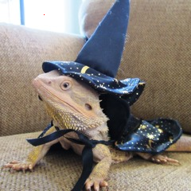
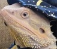

#   1. Images – read, write and display; ROIs

>**a)** Read the name of a file containing an image in 'jpg' format and show it in a window, whose name is the name of the
file. Test whether the image was successfully read. Display the height and width of the image, on the console.

>**b)** Read a color image from a file in 'jpg' format and save it in 'bmp' format.

>**c)** Read a color image from a file, show the mouse cursor over the image, and the coordinates and RGB components of
the pixel under the cursor. When the user clicks on the mouse, let him modify the RGB components of the selected
pixel.

>**d)** Read an image from a file, allow the user to select a region of interest (ROI) in the image, by clicking on two points
that identify two opposite corners of the selected ROI, and save the ROI into another file.

