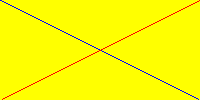
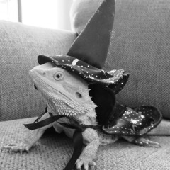
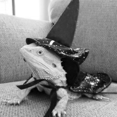
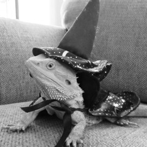
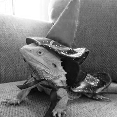
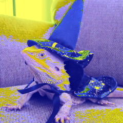
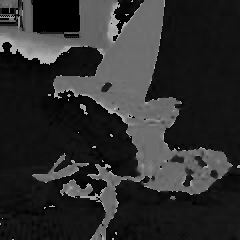
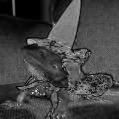
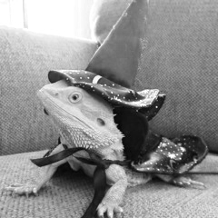
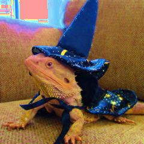

# 2. Images – representation, grayscale and color, color spaces

>**a)** Create a grayscale image, having 100 (lines) x 200 (columns) pixels with constant intensity, 100; draw the two
diagonals of the image with intensity 255. Display the image.

>**b)** Create a color image, having 100 (lines) x 200 (columns) pixels with yellow color; draw the two diagonals of the
image, one in red color, the other in blue color. Display the image.

>**c)** Read a color image, display it in one window, convert it to grayscale, display the grayscale image in another window
and save the grayscale image to a different file.

>**d)** Read an image (color or grayscale) and add "salt and pepper" noise to it. The number of noisy points must be 10%
of the total number of image points. Suggestion: start by determining the number of image channels.

>**e)** Read a color image, in RGB format, split the 3 channels and show each channel in a separate window. Add a
constant value to one of the channels, merge the channels into a new color image and show the resulting image.

>**f)** Read a color image, in RGB format, convert it to HSV, split the 3 HSV channels and show each channel in a separate
window. Add a constant value to saturation channel, merge the channels into a new color image and show the
resulting image.

