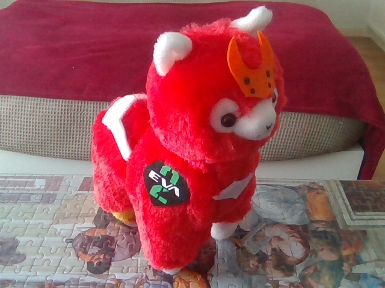
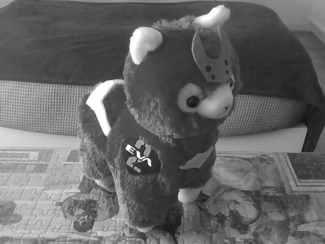
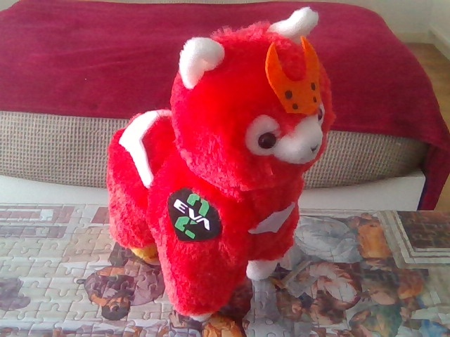
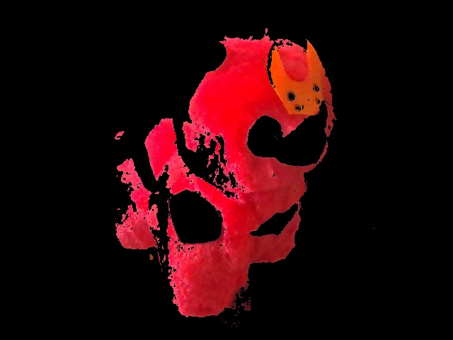

# 3. Video – acquisition and simple processing

>a) Display a video acquired from the webcam (in color) in one window and acquire and save a frame when the user
presses the keyboard. Show the acquired frame in another window.

>b) Display the video acquired from the webcam (in color) in one window and the result of the conversion of each
frame to grayscale in another window.

>c) Modify the program developed in b) so that the resulting frames are in binary format (intensity of each pixel is 0 or
255); use a threshold value of 128.

>d) Implement a simple tracking algorithm for colored objects, using the following steps: 1) take each frame of the
video; 2) convert from BGR to HSV color-space; 3) threshold the HSV image for a range of color values (creating a
binary image); 4) extract the objects of the selected range (use a bitwise AND operation, using as operands the
original and the binary image).

